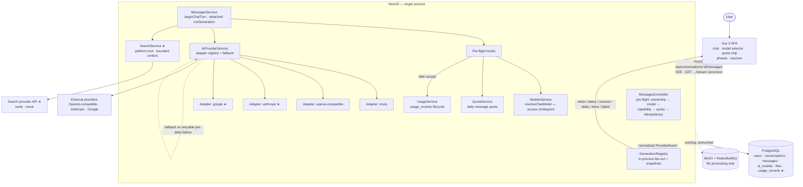

# Day 7–8 Architecture Decisions — Multi-Model Platform

> **Status:** Shared contract. **This document is the single source of truth for
> Day 7–8 development.** Both developers (and their AI agents) MUST read it
> before writing code, and MUST NOT deviate from the sections
> [Shared Contracts](#22-shared-contracts-between-developers) and
> [Invariants](#13-invariants) without agreement recorded in this file.
>
> Everything marked **[Existing]** describes the repository as it is today
> (after Stage 17 / the Day 5–6 merge). Everything marked **[Proposed]** is what
> Day 7–8 adds. Nothing here is implemented yet.

> **Implementation status (2026-09-18, Stage 18):** the provider/model core of
> §5, §6 (capabilities only) and §22.3/§22.4/§22.7 has landed on
> `feature/MS-MultiModel-AIProviderManagement` — adapters (`mock`,
> `openai-compatible`, `anthropic`, `google`), the `ProviderEvent` /
> `ProviderError` contracts and `ai_models.capabilities`. One refinement to
> §5: the per-request timeout lives in a shared helper
> (`requestSignalWithTimeout`) consumed by each adapter — it honors the
> orchestrator's `AbortSignal` per §22.3 while keeping the historical budget
> semantics (covers request establishment, not the whole stream). §7
> usage/quota, §8 plans, §9 search, §12 fallback and the pricing/fallback
> columns remain **unimplemented** (their work packages are still open).

> **Implementation status (2026-09-18, Stage 19 — Work Package B):** §7 usage/
> quota, §8 plans, §15 (users.plan, ai_models pricing, usage_records) and the
> §16 endpoints (`GET /usage/me`, `PATCH /admin/users/:userId/plan`,
> `GET /admin/usage/summary`, `GET /admin/users`) have landed. Three
> deliberate deviations from this contract, agreed with the product owner:
> 1. **Failed turns do NOT consume the message quota** — the quota count
>    excludes `outcome='failed'` rows (the original §7.4 charged failed
>    turns). Tokens/cost of failed turns are still recorded for accounting;
>    a retry reuses the same usage row, so a turn is quota-charged at most
>    once (when it produces output). Reason: the product invariant
>    "failed requests must not incorrectly consume quota" overrides §7.4;
>    the usage-row design makes this a COUNT filter, not a refund machine.
> 2. **Optional daily token limit** per plan (`QUOTA_FREE_DAILY_TOKENS` /
>    `QUOTA_PREMIUM_DAILY_TOKENS`, unset ⇒ unlimited) checked pre-stream —
>    §7 declared token quotas out of scope; the requirement was re-instated
>    as an opt-in env cap with the documented retroactive-accounting caveat
>    (tokens land at terminal, so the check sees last-known totals).
> 3. **`total_tokens` is derived** (input + output) in API responses, not
>    stored — one source of truth for the "consistent token counting"
>    invariant. Also `usage_records.outcome` gains the initial value
>    `pending` (the contract listed only terminal values).
> 4. **Pricing precision widened** from `numeric(12,6)` to `numeric(14,6)` —
>    (12,6) allows only 6 integer digits, so a 1,000,000-Toman-per-1M-tokens
>    price (a realistic figure) overflows on insert. Caught by the Stage 19
>    E2E quota test.

---

## 1. Purpose

The platform evolves from a single-provider chat into a multi-model platform:
several providers (native adapters), model capabilities, per-user quotas and
usage/cost accounting, web search as a platform tool, visible execution phases,
and provider fallback — all without breaking the Day 1–6 guarantees
(detached generation, reconnect, idempotency, file context).

Two developers will work in parallel on intersecting modules
(`messages.service.ts`, `ai-model.entity.ts`, the SSE contract, `api/client.ts`).
This document exists so that two independent implementations converge on the
same database columns, event names, error kinds and function seams — instead of
discovering the contract in a merge conflict.

Rules of engagement:

1. Section 22 (Shared Contracts) is normative. If code and this document
   disagree, this document wins until it is amended by agreement.
2. Prefer the simplest change that satisfies a requirement (see Decision Log).
3. No infrastructure beyond what exists (Postgres, Redis+BullMQ for files,
   MinIO). Nothing in Day 7–8 needs new infrastructure.

---

## 2. Current System Snapshot

**[Existing]** A modular NestJS monolith (`backend/src/`) + Vue 3 / Vite SPA
(`frontend/src/`), ports 4000 / 5200, `/api` proxied by Vite. Full picture:
`docs/ARCHITECTURE.md`, log in `docs/STAGES.md`.

### Backend structure

| Module | Responsibility |
|---|---|
| `auth/` | register/login, bcrypt, JWT (1 day), admin seeded from env. Global `JwtAuthGuard` + `RolesGuard` (`@Public()` opt-out, `@Roles('admin')` for admin). |
| `users/` | `User` entity: `id, email, passwordHash, role: 'user'\|'admin', createdAt`. **No plan/quota fields.** |
| `conversations/` | owned CRUD-lite; ownership checked inside the lookup (foreign → 404). |
| `messages/` | chat turn orchestration. `MessagesService.beginChatTurn()` pre-persists the user + assistant rows, then runs a **detached** `runGeneration()` loop; `GenerationRegistry` (in-process) fans deltas out to the HTTP response and serves reconnect snapshots. |
| `models/` | `AiModel` entity + admin CRUD + `resolveChatModel()` — the single chat authorization chokepoint (unknown → 404, inactive → 400, not allowed for plan → 403). `UserPlan = 'free'` type exists but is not persisted anywhere. |
| `ai/` | `AiProviderService.streamChat(history, model)` — one class, `switch` on `model.provider`: `'mock'` (canned chunks) and `'openai-compatible'` (`fetch` SSE parser, 60 s `AbortController` timeout). Yields plain text deltas. |
| `files/` | Day 5–6: upload → MinIO, BullMQ worker, PDF/Excel/OCR extraction, `fileIds` as bounded prompt context (`buildContextualPrompt`). |
| `common/`, `config/`, `database/` | guards/decorators/global Persian exception filter; typed env config; TypeORM. |

### Chat request flow (today)

```
POST /api/conversations/:id/messages            (JWT; {content, modelId?,
                                                   clientMessageId?, fileIds?})
 └─ MessagesController
     1. assertChatTurnAllowed()  ← ALL 4xx checks before SSE flush:
        ownership → resolveChatModel (active/plan) → idempotency lookup
        (replay or content-collision 400) → file readiness
     2. SSE headers flush (200 text/event-stream)
     3. beginChatTurn(): persist user row (+attached_file_ids) and assistant
        row (status='pending'); subscribe to GenerationRegistry
     4. runGeneration() (detached): provider deltas → registry fan-out →
        throttled DB persist (1.5 s) → terminal save (completed|failed)
```

Client disconnect only unsubscribes; the generation finishes server-side.
`GET /conversations/:id/messages/:messageId/stream` re-attaches
(snapshot → remaining deltas → terminal). Orphaned rows (process restart)
surface as `interrupted` with Retry.

### Streaming contract (today)

Wire events, in order — the contract Day 7–8 **extends, never breaks**:

| Event | Endpoint | Payload |
|---|---|---|
| `meta` | send | `{ userMessage, assistantMessage(status=pending), model:{id,name,provider}, replay }` |
| `delta` | send + reconnect | `{ text }` (append-only) |
| `snapshot` | reconnect | `{ assistantMessage }` (REPLACE, full content so far) |
| `done` | terminal | `{ assistantMessage }` |
| `failed` | terminal | `{ assistantMessage, message }` (safe Persian text only) |

`message.status ∈ {pending, streaming, completed, interrupted, failed}`
(null on user rows). Messages carry `modelId` per turn (`SET NULL` on model
delete — history survives), `clientMessageId` idempotency
(`(conversation_id, role, client_message_id)` index; replay = same user row,
fresh assistant row), `attachedFileIds` (jsonb).

### Database (today)

```
users(id, email UNIQUE, password_hash, role)
conversations(id, user_id CASCADE, title, timestamps)
messages(id, conversation_id CASCADE, role, content, status, error_message,
         model_id SET NULL, client_message_id, attached_file_ids jsonb, created_at)
ai_models(id, name, provider varchar(40), external_model_id, base_url, api_key,
          is_active, is_free, is_default, created_at)
files(id, user_id CASCADE, conversation_id CASCADE, original_name, mime_type,
      size, storage_key, status, extracted_text, error_message, attempts, …)
```

Schema via `DB_SYNCHRONIZE` (documented MVP shortcut).

### Frontend (today)

- `api/client.ts`: JSON `api()` + `streamChatMessage()` (POST SSE reader,
  `onMeta/onDelta/onDone`) + `reconnectGenerationStream()` (GET SSE reader,
  `onSnapshot/onDelta/onDone/onFailed`), session in `localStorage`
  (`hooshyar.token`, `hooshyar.user`).
- `views/ChatView.vue`: conversations sidebar, optimistic send, streaming row,
  reconnect-on-load, retry with original `clientMessageId` + `fileIds`,
  sequential upload queue.
- `components/chat/ModelSelector.vue` (emits `select`), `MessageComposer.vue`,
  `MessageItem.vue`, `FileChip.vue`.
- Admin: `AdminModelsView` (drawer create/edit, default/free rules),
  `AdminFilesView`. Router guards `adminOnly`.
- Theming per `DESIGN_SYSTEM.md` (source of truth for UI work).

### Tests (today)

Backend: Jest **174/174** (unit, mocked repositories) + three Node E2E scripts
(`scripts/smoke-test.mjs` 75, `resilience-test.mjs` 28,
`file-processing-test.mjs` 53 — require a live backend). Frontend: `vue-tsc` +
build + `tests/uploadQueue.test.mjs`. **No k6 yet.**

---

## 3. Day 7–8 Goals

### Required

1. **Multi-provider management** — provider adapters beyond
   `openai-compatible` (add `anthropic`, `google` native adapters; keep `mock`).
2. **Model capabilities** — models declare what they support
   (at minimum `web-search`, `reasoning`); picker and send path respect them.
3. **Usage tracking** — one usage record per accepted chat turn with token /
   character counts and outcome.
4. **User quotas** — daily per-plan message quota, checked pre-stream,
   surfaced in the UI; replays never double-consume.
5. **Plans & model access** — `users.plan ∈ {free, premium}`, admin-set;
   `resolveChatModel` stays the single chokepoint.
6. **Cost tracking** — per-model prices; cost computed per usage record and
   aggregated for the admin.
7. **Web search** — platform-side search tool, injected as bounded prompt
   context; sources persisted on the message and shown as citations.
8. **Execution phases** — safe streaming status (`thinking`, `searching`,
   `generating`); **no chain-of-thought is ever exposed**.
9. **Provider fallback** — one optional, pre-first-delta fallback model per
   model, configured by the admin.
10. **Streaming compatibility** — all of the above rides the existing SSE
    contract additively; Day 1–6 clients keep working.

### Optional (only if the required set lands cleanly)

- `GET /admin/usage/summary` (per-day / per-model token + cost aggregation).
- Provider health indicator in the admin model table (last error + latency).
- Persian number formatting of token counts in the UI.

### Explicitly out of scope

See [§20 Explicit Non-Goals](#20-explicit-non-goals).

---

## 4. High-Level Architecture



★ = new in Day 7–8. Everything else exists. **No new services, queues, caches
or processes are introduced** — search runs inline in the generation loop
(bounded by a timeout), usage rows are written in the existing persistence
path, and the quota check is one indexed COUNT.

---

## 5. AI Provider Architecture

**[Existing]** one `AiProviderService` class with an internal `switch`; deltas
are plain `string`s; errors are bare `Error`s with the HTTP status glued into
the message.

**[Proposed]** Keep the module and the public entry point
(`AiProviderService.streamChat`), split the inside:

```
backend/src/ai/
├── ai-provider.service.ts      # orchestrator: adapter lookup + normalization (+ fallback, §12)
├── provider-adapter.ts         # [Proposed] the shared interface + error types (§22.3)
├── provider-errors.ts          # [Proposed] ProviderError kinds
└── adapters/
    ├── mock.adapter.ts         # [Proposed] extracted from the current switch arm
    ├── openai-compatible.adapter.ts  # [Proposed] extracted (current fetch+SSE parser)
    ├── anthropic.adapter.ts    # [Proposed] new
    └── google.adapter.ts       # [Proposed] new
```

Rules:

- **Adapter pattern**: each provider adapter implements
  `ProviderAdapter` (exact shape in §22.3). It owns provider-specific request
  building, SSE parsing, abort/timeout and token-usage extraction.
- **Strategy selection**: `AiProviderService` keeps a `Map<AiProviderKind,
  ProviderAdapter>`; `model.provider` (already a DB column, varchar(40) —
  **no migration needed to add provider kinds**) selects the strategy.
- **Model registry**: the `ai_models` table **is** the registry (source of
  truth, re-read per request — already the behavior in `resolveChatModel`).
  No in-process cache (rejected: premature; the DB lookup is one indexed row).
- **Normalized output**: adapters yield `ProviderEvent`s (text / status /
  usage — §22.3), never raw provider payloads. `AiProviderService` is the only
  place allowed to know a provider's wire format besides its adapter.
- **Error normalization**: adapters throw `ProviderError` with a closed set of
  `kind`s (§22.4). The generation loop and fallback policy branch on `kind`
  only — never on message text or HTTP codes.
- **Streaming support is mandatory** for every adapter (the whole product is
  built on delta streaming); non-streaming providers are not accepted.
- Timeout: keep the existing per-request `AbortController` +
  `AI_REQUEST_TIMEOUT_MS` (default 60 s) inside each adapter.

`mock` stays a first-class adapter (tests and demos depend on it).

---

## 6. Model Architecture

**[Existing]** `ai_models`: `name`, `provider`, `externalModelId`, `baseUrl`,
`apiKey` (never serialized; `hasApiKey` flag), `isActive`, `isFree`,
`isDefault` (transactional swap; default must be active+free; first active+free
model auto-defaults; default cannot be deactivated/un-freed/deleted).

**[Proposed] additions (exact columns in §15):**

- `capabilities: string[]` (jsonb, default `[]`) — well-known values
  `"web-search"` (this model may be combined with the search tool) and
  `"reasoning"` (adapter may emit thinking phases / the UI shows a thinking
  affordance). Unknown values are rejected at the admin boundary (closed set,
  extendable by editing the validation list).
- `fallbackModelId: uuid | null` — optional single fallback (see §12).
- `inputPricePerMillion`, `outputPricePerMillion: numeric | null` — pricing
  (see §7). Null ⇒ cost is not computed for that model.

Model identity rules (unchanged + extended):

- `provider` + `externalModelId` identify the upstream model; `name` is the
  Persian display name. `id` (uuid) is the only reference stored on messages.
- `isActive=false` blocks **new** turns only (`resolveChatModel` 400 — existing
  behavior). Historical `messages.modelId` keep pointing at the row; deleting a
  model sets them `NULL` (`SET NULL` — existing) and the UI already renders the
  fallback attribution «دستیار هوشمند» — that behavior is the required pattern
  for §6 "historical conversations stay valid".
- `isDefault` rules are unchanged. **New invariant:** the default model must
  keep `capabilities` that satisfy an empty request (it always does —
  capabilities only *unlock* opt-in features; the default never *requires*
  web search).
- Access: `isFree` keeps its meaning ("usable on the free plan"). A premium
  model (`isFree=false`) is usable by `plan='premium'` users (and admins).
  See §8.

---

## 7. Quota and Usage Architecture

Three distinct concepts — do not conflate them:

| Concept | Meaning | Where it lives |
|---|---|---|
| **Quota** | A *limit*: how many chat turns a user may start per day (per plan). | Config (`QUOTA_FREE_DAILY_MESSAGES` default 50, `QUOTA_PREMIUM_DAILY_MESSAGES` default 500 — product-tunable env, no DB row) + computed live from `usage_records`. |
| **Usage** | A *fact*: one row per accepted chat turn (tokens/chars, outcome, model, cost). | New `usage_records` table. |
| **Cost** | A *derivation*: tokens × model price (Toman per 1 M tokens). | Column on `usage_records`, computed at turn completion; aggregated by admin queries. |

**[Proposed] lifecycle (the part both developers must implement identically):**

1. **Check (pre-stream).** Inside `assertChatTurnAllowed`, after model
   resolution and **after** the idempotency lookup, `QuotaService`
   counts today's usage rows (`WHERE userId AND createdAt >= startOfUtcDay`).
   Exhausted → `429` JSON error («سهمیه پیام‌های امروز شما تمام شده است…»)
   *before* SSE flush. Ordering matters: a **replay** (same
   `clientMessageId` + same content) is detected first and never re-counted.
2. **Reserve/consume (on accept).** The `usage_records` row is inserted in the
   same code path that persists the user message row, with
   `messageId = userMessage.id` and a **UNIQUE constraint on `message_id`** —
   that constraint *is* the dedupe mechanism: replays reuse the user row, so a
   second insert is impossible; a duplicate send under the same idempotency
   token can never bill twice.
3. **Complete (terminal).** When `runGeneration` reaches its terminal save
   (`completed` / `failed`; `interrupted` on process death is reconciled by
   outcome `interrupted` at reconnect), the row is updated best-effort with
   `inputTokens/outputTokens` (when the adapter reported usage), always
   `inputChars/outputChars`, computed `cost` + `estimated` flag, and
   `outcome`. A failure to update usage must never fail the message save.
4. **Failed requests.** A turn whose generation fails still consumed a slot
   (the turn was accepted and provider work was attempted). Retry reuses the
   same user row → the same usage row → **no second charge**. This is the
   deliberate, documented trade (simplest lifecycle consistent with
   idempotency).
5. **Streaming.** Tokens are unknown until the provider's final usage event
   (or never, for providers that don't report usage). The row is updated once
   at terminal, not per delta. Reconnects never touch usage (they attach to the
   same generation).
6. **Concurrency.** No locks. Two simultaneous sends both pass the count check
   and both insert — worst case the day's limit is exceeded by the number of
   concurrently racing requests. **Accepted for MVP** (documented, bounded,
   observable via usage rows); the unique `message_id` prevents *unbounded*
   duplication. If this ever matters, the fix is a conditional
   `INSERT … WHERE` counter row — explicitly out of scope now.
7. **Cost estimation.** When a provider reports no token usage:
   `estimated = true`, tokens are `chars / 4` (documented heuristic), cost is
   computed from those estimates. `inputPricePerMillion = null` ⇒ cost null.

Quota is **per chat turn** (user message), not per token — token quotas are
explicitly out of scope (§20).

---

## 8. Access Control

**[Existing]** `ModelsService.resolveChatModel(modelId?, plan)` is the single
chokepoint: unknown → 404, inactive → 400, plan-mismatch → 403. Frontend
filtering is never trusted. `GET /models` already returns the plan-filtered
list (`listAvailable(plan)`).

**[Proposed]:**

- `users.plan ∈ {'free','premium'}` (default `'free'`). Source of truth: the
  users table. JWT **is not** extended with the plan — the plan is read from
  the DB inside the request (fresh per send, same rationale as model state:
  admin changes take effect on the next request, not on token expiry).
- `plan='premium'` sees every active model; `plan='free'` sees active + `isFree`
  (existing semantics, now fed by the real column). Admin (`role='admin'`)
  bypasses quota checks but not model-state checks.
- Model-specific access beyond free/premium (per-user model grants,
  group policies) is **out of scope**.
- Capability check: if the request sets `webSearch: true` and the resolved
  model lacks `"web-search"`, pre-flight rejects with 400 («این مدل از جستجوی
  وب پشتیبانی نمی‌کند.»). Capabilities gate *opt-in request features*, not
  the base turn.
- Authorization boundary (single place, in order):

```
JwtAuthGuard → RolesGuard → assertChatTurnAllowed:
  1. conversation ownership            (ConversationsService — existing)
  2. model resolution + plan access    (ModelsService.resolveChatModel — existing)
  3. idempotency replay/collision      (existing)
  4. capability check (webSearch)      [Proposed, Dev A]
  5. quota check                       [Proposed, Dev B]  (skipped for replays at step 3)
```

---

## 9. Web Search Architecture

**[Proposed]** Search is a **platform tool**, not a provider feature — it runs
in the orchestrator and works with every provider including `mock`. That
decision (vs. provider-native tool calling) keeps all adapters simple, works
around "provider without tool support" entirely, and matches the existing
file-context pattern (`buildContextualPrompt`).

```
backend/src/search/
├── search.service.ts        # SearchService: runs the tool, bounds results, times out
├── search-provider.port.ts  # interface SearchProvider { search(query): Promise<SearchHit[]> }
├── tavily.search-provider.ts # real adapter (Tavily API; SEARCH_PROVIDER='tavily')
└── mock.search-provider.ts   # deterministic adapter for tests (SEARCH_PROVIDER='mock')
```

- **Tool abstraction**: `SearchProvider` port, selected by
  `SEARCH_PROVIDER ∈ {none, mock, tavily}`. `none` (the default) disables the
  feature globally: `webSearch: true` then fails pre-flight with 503-style
  «جستجوی وب فعال نیست.» — the capability never advertises in `GET /models`.
  API key: `SEARCH_API_KEY`; timeout `SEARCH_TIMEOUT_MS` (default 8 000).
- **Execution**: inside `runGeneration`, *before* the provider call, when the
  turn requested search: emit `status: searching` → run search → build bounded
  context. Query = the user's message content (trimmed to 400 chars). Result
  limit: top 5 hits, each snippet ≤ 300 chars (`SEARCH_MAX_RESULTS`).
- **Result representation** (`SearchHit`): `{ title, url, snippet }` — nothing
  else is stored or streamed.
- **Prompt injection**: `buildSearchContext(hits, maxChars)` (mirrors
  `file-context.ts`, same delimiters discipline), appended to the contextual
  prompt *after* file context, capped by `files.maxContextChars` budget
  (search gets at most half the budget when files are also present).
- **Citations**: hits are persisted on the assistant row
  (`messages.sources` jsonb, ≤ 5) immediately after the search returns (so the
  reconnect `snapshot` includes them), and streamed once via the `sources`
  event before the first delta. The model is *asked* to cite `[1]…[n]`; the UI
  renders the source list from the persisted array — rendering does not depend
  on the model actually citing.
- **Failure handling**: search error or timeout → **degrade, never fail the
  turn**: log, skip injection, continue generating without sources; the user
  sees a subtle «جستجو انجام نشد» notice via a `status` event with
  `detail: 'search-failed'`. Empty result set → proceed with no sources and no
  error (a `status` event with `detail: 'search-empty'` is optional).

---

## 10. Thinking / Reasoning

**[Proposed]** The UI may display **execution phases only**. The closed set:

| Phase | Meaning | Emitted when |
|---|---|---|
| `thinking` | Turn accepted, provider warming up / reasoning before first token | after `meta`, before first delta (adapters may also signal it mid-stream via `ProviderEvent.status`) |
| `searching` | Web search tool executing | around the search call |
| `generating` | Text is streaming | at first delta (uniform signal; clients may also derive from `delta`) |

- These are **status labels about the system's execution**, not model output.
- **Private chain-of-thought is never exposed**: adapters MUST NOT surface
  `reasoning`/`thinking` token streams from providers even when the wire
  format offers them (e.g. OpenAI-compatible `reasoning_content`). If we later
  expose provider-generated *reasoning summaries*, that is a separate,
  explicitly-approved feature — summaries would arrive as ordinary `text`
  deltas and be persisted as content. Nothing in Day 7–8 does this.
- Phases are ephemeral: not persisted on the message, not replayed on
  reconnect (the snapshot shows current content; the client shows
  `generating` until the terminal event — acceptable and simple).

---

## 11. Streaming Contract

**[Existing]** events `meta → delta* → done|failed` (send) and
`snapshot → delta* → done|failed` (reconnect). Full grammar in §2 and
`messages.controller.ts`.

**[Proposed] additions — additive only:**

| Event | Endpoint | Payload | Notes |
|---|---|---|---|
| `status` | send | `{ status: 'thinking'\|'searching'\|'generating', detail?: string }` | optional; `detail` only from the closed set (`search-failed`, `search-empty`) |
| `sources` | send | `{ sources: SearchHit[] }` | once, after search, before first delta; only when search ran |
| `meta` (extended) | send | + `{ webSearch: boolean }` | lets the UI title the phase row |
| `done` (extended) | terminal | `assistantMessage` + `sources` field (nullable) and `usage: { inputTokens, outputTokens, cost, estimated } \| null` | old fields unchanged |
| `snapshot` (extended) | reconnect | `assistantMessage` carries `sources` (persisted column) | usage is not replayed (fetch via REST if needed later) |

Ownership & ordering rules (normative):

1. `meta` is always the first event on the send stream; `snapshot` always
   first on reconnect. Exactly one terminal event (`done` or `failed`) per
   stream — existing rule, unchanged.
2. `status`/`sources` may only appear **before the first `delta`** except
   `status: generating`, which coincides with it. After the first delta no
   further `status` events are emitted in MVP.
3. New events are *ignorable*: a client that only knows
   `meta/delta/done/failed` (Day 1–6 `api/client.ts` dispatch — it skips
   unknown event names in its parser) behaves exactly as before. **Do not
   rename or retime existing events.**
4. Reconnection: statuses are not replayed; sources ride the snapshot.
   The reconnect stream gains no new events in MVP.
5. Errors: terminal `failed` keeps carrying the persisted row + one safe
   Persian sentence; internal detail stays in logs (existing rule).
6. Event name style: kebab/lowercase is **not** used — existing single words
   (`meta`, `delta`, `done`, `failed`, `snapshot`) plus the new `status`,
   `sources`. No nesting, no versioning field.

---

## 12. Fallback and Graceful Degradation

**[Proposed]** Minimal, deterministic, one hop:

- **Configuration**: `ai_models.fallbackModelId` (nullable, admin-set). Rules
  enforced at the admin boundary: the fallback must exist, be active, and be
  at least as accessible as the primary (`isFree` ≥ primary's — a free user
  must never fall back into a 403). Self-reference and cycles are rejected
  (cycles are impossible with a single hop, but the admin edit still rejects
  `fallbackModelId === id`).
- **Trigger**: exactly one retryable provider failure **before the first
  published delta** (kinds `timeout`, `unavailable`, `rate-limit` — §22.4).
  `runGeneration` catches the normalized `ProviderError`; if the model has a
  fallback and the fallback still resolves (active + plan-accessible, checked
  in-memory against the already-loaded row + user plan), the loop restarts
  with the fallback model: `assistantMessage.modelId` is updated to the
  fallback **before** streaming continues, so `meta`→(already sent)… careful:
  `meta` already carried the primary model. Consequence (accepted): the send
  stream's `meta.model` shows the requested model; the **terminal**
  `done.assistantMessage.modelId` shows the model that actually answered, and
  a `status` event `{ status: 'generating', detail: 'fallback' }` is emitted
  right after the switch. History stays truthful (persisted `modelId` =
  fallback).
- **Never after the first delta**: partial content is never discarded or
  regenerated mid-stream (duplicate-text risk). If the provider dies after
  deltas, existing `failed` semantics apply.
- **Immediately reach the user (no fallback)**: `auth` (bad API key),
  `invalid-request` (provider 4xx we sent), `invalid-config`, `unknown` —
  these fail the turn with the existing generic Persian message.
- **Duplicate-generation prevention**: fallback happens inside the same
  `runGeneration` before any `publishDelta`; the registry buffer and the
  persistence path see one continuous generation. Idempotency is untouched (a
  *retry* of the turn is a new assistant row on the same user row — existing).
- **No retry counts, no backoff, no circuit breakers, no cross-process
  coordination** — rejected as premature (Decision Log). One hop, one try.

---

## 13. Invariants

Numbered for citation in code comments, tests and reviews. INV-1…INV-5 already
exist in the codebase (kept); INV-6+ are new.

| # | Invariant | Observable consequence |
|---|---|---|
| INV-1 | A valid default model always exists (active + free). | Admin boundary refuses deactivate/un-free/delete of the default; `resolveChatModel(undefined)` never returns a disabled model; missing default → 400 pre-stream. |
| INV-2 | Disabled (or plan-forbidden) models receive no new requests. | `resolveChatModel` re-reads state per send; inactive → 400, plan-mismatch → 403, both JSON pre-stream. |
| INV-3 | Historical messages stay understandable after a model is disabled or deleted. | `messages.modelId` `SET NULL` on delete; UI renders «دستیار هوشمند» fallback attribution; content/status untouched. |
| INV-4 | Unauthorized users cannot use restricted models — including direct API calls. | The chokepoint (§8) is server-side only; `GET /models` filtering is cosmetic. |
| INV-5 | One assistant row per turn, exactly one terminal SSE event, idempotent retries reuse the user row. | Existing tests (Jest streaming specs, resilience script 28/28) keep passing unchanged. |
| INV-6 | Quota cannot be bypassed by refresh or retry. | Replay path returns before the quota check; `usage_records.message_id` UNIQUE makes double-charging impossible even under races. |
| INV-7 | Usage rows mirror the request lifecycle. | Row created with the user row, terminal-updated exactly once (`outcome ∈ completed/failed/interrupted`); reconnect streams create/update nothing. |
| INV-8 | Every streamed event sequence obeys §11 (meta/snapshot first; one terminal; new events ignorable). | Contract test asserts event order for: plain turn, search turn, fallback turn, failed turn. |
| INV-9 | Provider failures never corrupt conversation state; fallback only pre-first-delta. | Failed turn = `failed` row + generic message (existing); fallback test proves no duplicated/partial text ever reaches `publishDelta` twice. |
| INV-10 | A failed generation is never rendered as completed. | Existing status machine; fallback restart also flips nothing to terminal until the provider stream truly ends. |
| INV-11 | Duplicate requests never produce duplicate billable work. | Idempotency (existing) + INV-6 unique key + single-hop fallback inside one generation. |
| INV-12 | Only safe execution phases are streamed; no chain-of-thought ever leaves the backend. | `status` payloads come from a closed enum; adapters strip provider reasoning channels (unit test asserts no `reasoning` content in events). |
| INV-13 | Search failure degrades; it never fails a turn and never injects unbounded text. | Search timeout test → turn completes without sources; context size capped by config. |
| INV-14 | `GET /models` never leaks secrets or admin-only fields. | `SafeModel` remains the only serializer; pricing exposed to admin endpoints only. |

---

## 14. Edge Cases

| Area | Edge Case | Expected Behavior |
|---|---|---|
| Provider | Provider unavailable (conn refused / 5xx) | Normalized `unavailable` (retryable) → single-hop fallback if configured, else turn `failed` with the existing generic Persian message; usage `outcome=failed`. |
| Provider | Invalid provider configuration (missing API key, bad base URL) | `invalid-config` (not retryable) → immediate `failed`; admin sees `hasApiKey=false` (already exposed). No fallback. |
| Model | Model disabled *during* an in-flight request | Generation continues with the already-resolved in-memory model (no mid-stream re-check); new turns are rejected by INV-2. |
| Model | Default model disabled | Impossible via admin boundary (INV-1). If the row is corrupted directly in the DB, sends without `modelId` return the 400 «مدل پیش‌فرضی تنظیم نشده…». |
| Quota | User quota exhausted | Pre-stream `429` JSON «سهمیه پیام‌های امروز شما تمام شده است.»; UI shows the quota chip as full and locks Send with an explanatory label. |
| Concurrency | Multiple simultaneous sends | All pre-flight checks pass per request; admitted turns may exceed the daily limit by the race width (documented §7.6); no corruption, each turn has exactly one usage row. |
| Streaming | Stream interrupted (transport drop after deltas) | Existing detached behavior: tokens kept, row continues server-side, reconnect re-attaches (unchanged). |
| Client | Browser refresh / new tab mid-generation | Existing reconnect: load conversation → auto-attach to pending/streaming row via GET stream; usage untouched (INV-7). |
| Client | Network disconnect mid-stream | Existing: local `interrupted` render + `useOnline` watcher re-attaches when back. |
| Provider | Provider timeout | `timeout` (retryable) → fallback if configured, else `failed` row with the existing timeout message («پاسخ هوش مصنوعی بیش از حد طول کشید…»). |
| Provider | Provider rate limit (429) | `rate-limit` (retryable) → fallback if configured, else `failed` generic message. No auto-retry/backoff in MVP. |
| Generation | Partial generation then provider death | Deltas kept (existing `failed` row with partial content, honest status). Fallback explicitly not attempted (§12). |
| Web search | Search provider fails / times out (8 s) | Degrade: log + `status{detail:'search-failed'}` + turn completes without sources (INV-13). |
| Web search | Empty result set | Proceed with generation, no `sources` event, no error surfaced (optional `search-empty` detail). |
| Capability | Provider/model without tool support | Search is platform-side — works with every provider. Model without `"web-search"` + `webSearch:true` → pre-flight 400. Global search off (`SEARCH_PROVIDER=none`) → 503-style pre-flight error; capability not advertised. |
| Fallback | Fallback model also unavailable | Turn `failed` (no second hop); usage row records the model actually attempted last; log both kinds. |
| Idempotency | Duplicate request (double-click / retry / replayed fetch) | Existing: same `clientMessageId`+content → replay (same user row, fresh assistant row); same token + different content → 400. Usage charged once (INV-6). |
| AuthZ | User plan downgraded mid-generation | In-flight turn completes (already accepted); the *next* send re-reads plan and may 403 on premium models. Admin upgrade takes effect on the next send. |

---

## 15. Database Changes

Schema management stays `DB_SYNCHRONIZE` (existing MVP shortcut — synchronize
must run once against the dev DB after the entities land).

### Existing — unchanged

`conversations`, `files`, `ai_models.id/name/provider/external_model_id/
base_url/api_key/is_active/is_free/is_default`, `messages.*` (Day 1–6 columns),
all existing indexes and FK behaviors.

### Modified

| Table | Change | Constraints / indexes |
|---|---|---|
| `users` **[Modified]** | `+ plan varchar(20) NOT NULL DEFAULT 'free'` | CHECK-free (validated in service); TS union `UserPlan = 'free' \| 'premium'` (the type already exists in `models.service.ts`, currently hard-coded `'free'`). |
| `ai_models` **[Modified]** | `+ capabilities jsonb NOT NULL DEFAULT '[]'` | Values from the closed set; validated in DTO/service, not DB. |
| `ai_models` **[Modified]** | `+ fallback_model_id uuid NULL REFERENCES ai_models(id) ON DELETE SET NULL` | Self/cycle rules enforced at the admin boundary (single hop makes cycles structurally impossible). |
| `ai_models` **[Modified]** | `+ input_price_per_million numeric(12,6) NULL`, `+ output_price_per_million numeric(12,6) NULL` | Toman per 1 M tokens; NULL ⇒ no cost computed. Never serialized to non-admin clients (INV-14). |
| `messages` **[Modified]** | `+ sources jsonb NULL` | ≤ 5 hits of `{title,url,snippet}`; only written by the search path; included in message serialization when non-null. |

### New

```
usage_records                                  [Proposed — Dev B owns]
  id             uuid PK
  user_id        uuid NOT NULL → users ON DELETE CASCADE
  conversation_id uuid NOT NULL → conversations ON DELETE CASCADE
  message_id     uuid NOT NULL UNIQUE → messages ON DELETE CASCADE   ← dedupe anchor (INV-6/7)
  model_id       uuid NULL → ai_models ON DELETE SET NULL            ← model actually used (post-fallback)
  provider       varchar(40) NOT NULL
  input_tokens   int NULL          ← provider-reported, else chars/4 estimate
  output_tokens  int NULL          ← provider-reported, else chars/4 estimate
  input_chars    int NOT NULL DEFAULT 0
  output_chars   int NOT NULL DEFAULT 0
  cost           numeric(14,6) NULL
  estimated      boolean NOT NULL DEFAULT false
  outcome        varchar(20) NOT NULL       ∈ {completed, failed, interrupted}
  created_at     timestamptz (CreateDateColumn)
  completed_at   timestamptz NULL

  INDEX idx_usage_user_created ON (user_id, created_at)   ← daily quota COUNT
```

Why a table (vs. counters on `users`): the unique `message_id` gives exact
idempotent accounting for free, the row doubles as the audit/admin aggregation
source, and no counter row can drift from reality. Rejected: Redis counters,
per-request reservations.

---

## 16. API Contracts

All routes are under `/api` (Vite proxy). Auth = JWT bearer (existing).
Serialization: SafeModel (no `apiKey`, `hasApiKey` flag) for anything
model-shaped to non-admin clients.

### Existing — extended

**`GET /models`** — user-facing picker list. **[Modified]**
- Auth: JWT. Plan taken from `users.plan` (fresh read).
- Response: `SafeModel[]` **+ `capabilities: string[]` + `hasFallback: boolean`**.
  No pricing. Search-capable models are only marked when
  `SEARCH_PROVIDER ≠ 'none'`.

**`POST /conversations/:conversationId/messages`** — send + stream. **[Modified]**
- Body: existing `{ content, modelId?, clientMessageId?, fileIds? }`
  **+ `webSearch?: boolean`** (default false).
- New pre-stream JSON errors (SSE never opens for these):
  - `429` quota exhausted (Persian message, §14).
  - `400` model lacks `"web-search"` capability.
  - `503` search requested but globally disabled.
- New streamed events: `status`, `sources` (§11) — only when applicable.

**`GET /conversations/:conversationId/messages/:messageId/stream`** — reconnect. **[Modified]**
- `snapshot.assistantMessage` now includes `sources` (nullable column) — no
  other change.

**Admin model CRUD — `GET/POST /admin/models`, `PATCH /admin/models/:id`,
`POST /admin/models/:id/default`, `DELETE /admin/models/:id`** (all
`@Roles('admin')`). **[Modified]**
- Create/Update DTOs **+** `capabilities?: string[]` (closed set),
  `fallbackModelId?: string | null` (uuid or explicit null to clear),
  `inputPricePerMillion?: number | null`,
  `outputPricePerMillion?: number | null`.
- Admin list/get responses include those fields **and** pricing (admin-only).
- New 400s: unknown capability value; fallback not found/inactive/less
  accessible than primary; `fallbackModelId === id`.
- Existing default-model 400s unchanged.

### New

**`GET /usage/me`** — quota/usage summary for the signed-in user. **[Proposed — Dev B]**
- Auth: JWT (any role).
- Response: `{ plan, quota: { dailyMessages }, today: { used, remaining } }`
  (`remaining ≥ 0`; admins get `quota: null`).
- Errors: 401 only.

**`PATCH /admin/users/:userId/plan`** — change a user's plan. **[Proposed — Dev B]**
- Auth: JWT + `@Roles('admin')`.
- Body: `{ plan: 'free' | 'premium' }`.
- Response: `{ id, email, plan }`.
- Errors: 404 unknown user; 400 invalid plan value.

**`GET /admin/usage/summary?days=7`** — aggregated usage/cost. **[Proposed — Optional]**
- Auth: JWT + admin. Response: per-day `{ turns, tokens, estimatedCost }` and
  per-model split. Implement only after the required set is done.

Contract hygiene: update `docs/openapi.yaml` and `docs/API.md` in the same PR
that lands each endpoint (existing repo convention).

---

## 17. Frontend Changes

All UI work follows `DESIGN_SYSTEM.md` (tokens, components, Persian copy
rules) and `AGENTS.md`. Reuse before create.

| Area | Component(s) | Change |
|---|---|---|
| Model selector | `chat/ModelSelector.vue` | Capability glyph(s) on options (e.g. search icon when `"web-search"`); nothing else — the pill/dropdown/placement stays. Data via extended `GET /models`. |
| Quota display | `layout/AppSidebar.vue` (profile block) | One line «پیام‌های امروز: n از m» (+ plan badge free/premium). Source: `GET /usage/me`, fetched on load and after each terminal event (cheap; no live metering). Admin sees plan badge only. |
| Execution phases | `chat/ChatView.vue` + a small `chat/PhaseIndicator.vue` (or inline in MessageItem's streaming slot) | While streaming: a compact status row cycling `در حال تفکر… / در حال جستجو… / در حال تولید…` from `status` events; falls back to the existing caret when no status arrived. `detail: 'fallback'` → subtle «مدل جایگزین استفاده شد» note; `'search-failed'` → «جستجو انجام نشد». |
| Sources | `chat/MessageItem.vue` (+ tiny source chip list, pattern of `FileChip`) | Under an assistant message: numbered source chips (favicon-less, `title` + external link, `rel="noopener"`) rendered from `assistantMessage.sources` / the `sources` event. Hidden when null/empty. |
| Web search toggle | `chat/MessageComposer.vue` toolbar | A search toggle (icon button, aria-pressed) shown **only** while the selected model has `"web-search"`; sends `webSearch: true`. Persisted per conversation in component state only (not DB). |
| Errors/fallback | toasts (`useToast`) + `MessageItem` failed state | Quota 429 → toast + composer lock with reason (existing `sendLockReason` pattern); capability 400 / search-off 503 → toast. Terminal `failed` unchanged. |
| Types | `api/types.ts` | `AiModel.capabilities`, `Message.sources`, `UsageSummary`, `StreamStatusEvent`, `SourcesEvent` — exact names in §22. |
| API client | `api/client.ts` | `streamChatMessage` gains optional `onStatus`/`onSources` handlers; unknown-event skipping behavior preserved (it already ignores unknown names). No changes to reconnect parser beyond reading `sources` off `snapshot.assistantMessage`. |

Do **not** redesign layouts, add new views, or introduce new state libraries.

---

## 18. Observability

Keep it boring: Nest `Logger` lines with the message id as the correlation id
(the codebase already logs per-message; no request-id middleware exists and
none is added). **No OpenTelemetry / Signoz in Day 7–8** — usage_rows +
structured logs answer every question this phase can ask (Decision Log).

New log lines (exact prefixes, level `log`/`error` as appropriate):

```
QuotaRejected userId=… used=… limit=…                       # 429 path
TurnAccepted messageId=… userId=… modelId=… plan=… webSearch=…
ProviderFallback messageId=… fromModel=… toModel=… kind=…   # single hop
ProviderError provider=… model=… kind=… httpStatus=… ms=…   # every normalized failure
TurnUsage messageId=… inChars=… outChars=… inTok=… outTok=… cost=… estimated=…
WebSearch messageId=… provider=… results=… ms=… failed=true|false
```

Metrics (deferred, derivable via SQL on `usage_records`): turns/day, tokens,
estimated cost, quota rejection count (from logs), fallback rate, provider
latency p95 (`ms=` field). If Signoz is ever wired, these log fields are the
source — nothing app-level changes.

---

## 19. Testing Strategy

Conventions: backend Jest unit specs with mocked repositories (existing
style), E2E Node scripts against a live backend + `mock` providers
(`scripts/*.mjs`), frontend `vue-tsc` + build + direct Node tests for
framework-free utils.

| Layer | Required tests |
|---|---|
| Provider adapters (Dev A) | Each adapter vs. a fake `fetch`: happy-path deltas, `usage` extraction, each `ProviderError` kind mapping (timeout abort, 429, 401, 4xx, 5xx, malformed SSE ignored). **Reasoning-channel stripping test (INV-12).** |
| Model architecture (Dev A) | Capability validation (closed set), fallback admin rules (self/missing/inactive/less-accessible rejected), default-model rules still green (existing specs must pass unchanged). |
| Fallback (Dev A) | Retryable pre-delta failure → fallback model answers, `modelId` persisted = fallback, `status detail='fallback'` emitted, no duplicate deltas; post-delta failure → no fallback; non-retryable → immediate failed. |
| Quota/usage (Dev B) | Count + 429; **replay consumes once** (same `clientMessageId` twice → one usage row); unique `message_id` dedupe; terminal update (`outcome`, tokens/chars, cost + estimated flag); reconnect creates nothing; admin bypasses quota; concurrent-send admission (documented race, assert rows == turns). |
| Plans/access (Dev B) | `resolveChatModel` matrix: plan × isFree × isActive × capabilities(400) — extend the existing models.service spec table. `PATCH /admin/users/:id/plan` authz (non-admin 403). |
| Web search (Dev A) | Mock provider: injection bounded, `sources` event order (meta → status(searching) → sources → delta…), persisted on snapshot, timeout → degradation path (INV-13), empty results, `none` → 503 pre-flight, capability 400. |
| Streaming contract (both) | Event-order contract test for: plain turn, search turn, fallback turn, failed turn, reconnect with sources (INV-8). Day 1–6 streaming specs (Jest + `resilience-test.mjs` 28/28) must pass **unmodified**. |
| API / E2E | Extend `scripts/smoke-test.mjs`: quota 429 + next-day reset (mock clock or date-boundary fixture), replay no-double-count, capability 400, plan upgrade/downgrade flow, sources in history after reload. |
| Frontend | `vue-tsc` + build; a Node test for any new framework-free util (e.g. phase-state reducer if extracted); manual/browser pass per repo convention (document in STAGES.md). |
| k6 (minimum useful) | **One** scenario, mock provider, 10–50 VUs: sustained chat turns for ~2 min asserting p95 first-delta latency and that quota rejections return 429 (not 5xx) at the boundary. Genuinely useful (guards the pre-flight path + SSE under load); anything more is out of scope. |

---

## 20. Explicit Non-Goals

Not in Day 7–8 — do not build, scaffold or "prepare for" any of these:

- Kubernetes, containers-as-deliverable, microservices, separate worker
  deployments for chat, service meshes, multi-region anything.
- Billing, payments, invoices, subscriptions, Stripe-like integration,
  wallets. Plans are admin-set flags, nothing more.
- Real-time token meters, streaming quota countdowns, per-token quotas.
- Provider-native tool calling / function calling (search is platform-side by
  design — §9).
- Exposing chain-of-thought or reasoning summaries (§10).
- Multi-hop fallback, retry policies with backoff, circuit breakers,
  per-provider health daemons.
- Model-response caching, semantic caching, prompt caching.
- OpenTelemetry/Signoz wiring, dashboards, alerting.
- Rate limiting (per-IP/per-user request throttling) — distinct from quota;
  existing non-goal, stays.
- Message regenerate endpoint, message editing, branching conversations.
- New admin analytics beyond the optional `GET /admin/usage/summary`.
- Breaking changes to Day 1–6 endpoints, events or entities (§11 rule 3,
  §6 history rules).

---

## 21. Implementation Boundaries

Two developers, two streams. Streams touch shared files; §22 pins the exact
seams, and the first PR of each stream should land its shared-file additions
(entity/DTO columns, event types) **early and small** so the other stream
rebases onto them instead of colliding.

### Work Package A — Provider & Model Platform + Search + Streaming (Dev 1)

| | |
|---|---|
| Owns | `backend/src/ai/**` (adapters split, `provider-adapter.ts`, `provider-errors.ts`), `backend/src/models/*` capability+fallback rules (entity columns, DTOs, service validation, admin 400s), `backend/src/search/**` (new), `messages.service.ts` **runGeneration only** (status/sources emission, search hook, fallback restart), `messages.controller.ts` (new event serialization + `serializeMessage.sources`), frontend `api/client.ts` event handlers, `ModelSelector`, `MessageComposer` search toggle, `MessageItem` phases + sources, `ChatView` wiring. |
| Depends on | Nothing from B at runtime. Reads `users.plan` only through an injected accessor B provides (or reads the relation directly until B lands — seam in §22.6). |
| Must complete first | `provider-adapter.ts` + `provider-errors.ts` + event type additions in `api/types.ts` (the contract files) — land before feature work. |
| Must NOT change | `assertChatTurnAllowed` quota hook, `usage_records`, `users` entity/plan endpoint, pricing columns/DTO fields, `GET /usage/me`, quota UI. |

### Work Package B — Plans, Quota, Usage & Cost (Dev 2)

| | |
|---|---|
| Owns | `backend/src/usage/**` (new: `QuotaService`, `UsageService`, module wiring), `users` entity `plan` column + `users.service` + `PATCH /admin/users/:id/plan`, `ai_models` pricing columns + DTO pricing fields + admin serialization, quota check inside `assertChatTurnAllowed` + usage row insert in `beginChatTurn` + terminal usage update, `GET /usage/me`, frontend quota/plan UI (`AppSidebar` profile, `useAuth` user type), `docs/API.md` for own endpoints. |
| Depends on | A's `ProviderError` kinds (only for logging at terminal update — can merge with plain strings first); A's `modelId`-after-fallback is read from the assistant row, no code dependency. |
| Must complete first | `usage_records` entity + `QuotaService` (pure, unit-testable) — the seam A's stream never touches but tests cite. |
| Must NOT change | `ai/` adapters, fallback logic, search module, SSE event emission, `messages.service.ts` `runGeneration`, frontend streaming/phases/sources components. |

### Shared files (merge-order discipline)

`ai-model.entity.ts`, `dto/create-model.dto.ts`, `dto/update-model.dto.ts`,
`admin-models.controller.ts`, `messages.service.ts` (different functions),
`api/types.ts`, `docs/API.md`, `docs/STAGES.md`. Rule: each stream's first PR
adds **only its own columns/fields/types** to shared files with no unrelated
edits; second stream rebases.

---

## 22. Shared Contracts Between Developers

Normative. Both agents implement exactly these names; renaming anything here
requires updating this file first.

### 22.1 Database contracts

Columns/tables exactly as §15: `users.plan`,
`ai_models.capabilities/fallback_model_id/input_price_per_million/output_price_per_million`,
`messages.sources`, `usage_records` (fields as listed; unique `message_id`;
index `(user_id, created_at)`).

### 22.2 API contracts

Routes exactly as §16, including error codes: quota `429`, capability `400`,
search-disabled `503`, plan `403` (existing), plan endpoint body
`{ plan: 'free' | 'premium' }`, `GET /usage/me` response shape.

### 22.3 AI provider interface

```ts
// backend/src/ai/provider-adapter.ts  [Proposed]
export interface ProviderAdapter {
  /** Streams one chat completion. MUST respect signal/timeout. */
  streamChat(history: ChatHistoryItem[], model: AiModel, signal: AbortSignal):
    AsyncGenerator<ProviderEvent>;
}

export type ProviderEvent =
  | { type: 'text'; text: string }                       // append to content
  | { type: 'status'; status: 'thinking' }               // optional, pre-first-token
  | { type: 'usage'; inputTokens: number; outputTokens: number }; // 0–1×, typically at end

// ChatHistoryItem: existing shape { role: 'user' | 'assistant'; content: string }
// AiProviderService.streamChat(history, model) keeps its signature (minus internal switch),
// normalizes adapter errors to ProviderError, and yields ProviderEvent.
```

Adapter lookup: `Map<AiProviderKind, ProviderAdapter>`; new kinds:
`'anthropic' | 'google'` added to `AiProviderKind` (DB column already
varchar(40) — no migration). The orchestrator (not adapters) implements
fallback (§12) and emits `searching`/`generating`.

### 22.4 Error contract

```ts
// backend/src/ai/provider-errors.ts  [Proposed]
export type ProviderErrorKind =
  | 'timeout' | 'rate-limit' | 'unavailable'   // retryable → fallback eligible
  | 'auth' | 'invalid-request' | 'invalid-config' | 'unknown'; // fail fast

export class ProviderError extends Error {
  constructor(
    public readonly kind: ProviderErrorKind,
    public readonly httpStatus: number | null,   // provider HTTP status when known
    message: string,                             // internal-only; NEVER sent to clients
  ) { super(message); this.name = 'ProviderError'; }
}
```

Client-facing text for provider failures stays the two existing Persian
sentences (timeout / generic) — unchanged.

### 22.5 Streaming event contract

Event names and payloads exactly as §11. The frontend parser contract:
`streamChatMessage(payload, { onMeta, onDelta, onDone, onStatus?, onSources? })`
— new handlers optional; unknown events ignored (already the parser's
behavior). Reconnect parser unchanged except `sources` rides
`snapshot.assistantMessage`.

### 22.6 Usage/quota seam (A ↔ B)

`assertChatTurnAllowed` gains, in this order (after idempotency):

```ts
// [B] capability validation is A's; quota is B's:
if (dto.webSearch) modelsService.assertCapability(model, 'web-search'); // A
await quotaService.assertQuota(userId);              // B; throws 429; no-op for admin/replay
```

Usage lifecycle hooks (B) in `beginChatTurn` (insert with user row) and in
`runGeneration`'s terminal save (update once). A's fallback restart updates
`assistantMessage.modelId` **before** first publish — B's terminal update must
read the model from the row, not from a captured variable. Plan accessor seam:
B exposes `usersService.getPlan(userId): Promise<UserPlan>`; A's fallback
accessibility check calls it (or passes the already-known plan in from the
pre-flight result object — preferred: `assertChatTurnAllowed` returns
`{ attachments, plan }`).

### 22.7 Capability & source representations

```ts
export const MODEL_CAPABILITIES = ['web-search', 'reasoning'] as const;
export type ModelCapability = (typeof MODEL_CAPABILITIES)[number];

export interface SourceRef {            // messages.sources items & `sources` event payload
  title: string;
  url: string;
  snippet: string;                       // ≤ 300 chars
}
```

Frontend type names (api/types.ts): `ModelCapability`, `SourceRef`,
`UsageSummary = { plan: UserPlan; quota: { dailyMessages: number } | null;
today: { used: number; remaining: number } }`, `StreamStatusEvent`,
`StreamSourcesEvent`, `AiModel.capabilities: ModelCapability[]`,
`Message.sources: SourceRef[] | null`.

### 22.8 Documentation duty

Each stream updates `docs/API.md` + `docs/STAGES.md` for what it ships, in the
same PR (existing convention). This file is amended only by mutual agreement.

---

## 23. Decision Log

| Decision | Choice | Reason | Alternatives Rejected |
|---|---|---|---|
| Adapter architecture | Split existing `AiProviderService` into `ProviderAdapter` map under `src/ai/adapters/`; keep one module, one public method | The switch already is an implicit strategy map; extraction is the minimal change that admits new providers without touching the orchestrator | Provider-per-Nest-module; a generic "provider SDK" abstraction; HTTP-microservice gateway |
| Model registry | `ai_models` table as-is, re-read per request | One indexed row per send; caching adds invalidation for no measurable gain at MVP scale | In-process registry cache; config-file model list |
| Web search execution | Platform-side tool in the orchestrator, context injected into the prompt (file-context pattern) | Works with every provider incl. mock; no tool-calling support required anywhere; matches existing bounded-context discipline | Provider-native function calling; a separate "research" microservice; client-side search |
| Quota accounting | `usage_records` row per accepted turn, UNIQUE(`message_id`), daily COUNT | Exact idempotent accounting for free (replays reuse the user row); doubles as audit + admin aggregation | Counter column on users (drifts); Redis counters (new infra, drifts); reservation table (complexity) |
| Quota check timing | Pre-stream inside `assertChatTurnAllowed`, after idempotency | 429 arrives as clean JSON; replays never re-check; mirrors every existing 4xx | Check at SSE open (orphan streams); post-hoc accounting only |
| Failed turns & quota | Accepted turns consume quota even if the provider fails; retries are free (replay) | Simplest lifecycle that can't double-bill; provider failures are rare and observable | Refund-on-failure (needs state machine + race handling) |
| Cost unit | Toman per 1 M tokens, `numeric(12,6)`, nullable | Matches product language; nullable = "not priced" beats magic zeros | Float columns; micro-currency ints; per-request cost table |
| Plans | `users.plan` read fresh per request; JWT unchanged | Admin plan changes take effect immediately; no token refresh ambiguity; one indexed read | Plan in JWT (stale until re-login); separate entitlements table |
| Fallback policy | Single hop, pre-first-delta only, admin-configured, accessibility-checked | Prevents duplicate/partial text; deterministic; zero new infra | Multi-hop chains; automatic provider-ranked fallback; retry-with-backoff; circuit breakers |
| Thinking display | Closed status set (`thinking/searching/generating`); no CoT | Safe, provider-agnostic, honest; satisfies the requirement without leaking reasoning | Streaming provider reasoning summaries (rejected for MVP); fake progress bars |
| New SSE events | Additive `status`/`sources`; existing events byte-compatible | Day 1–6 clients keep working; reconnect semantics untouched | Versioned event schema; wrapping events in an envelope; renaming `failed` |
| Status persistence | Phases are ephemeral; sources are persisted on the row | Phases are UI narration; sources are data. Snapshot already carries row columns | A status audit table; replaying statuses on reconnect |
| Observability | Structured Nest logs w/ message-id correlation; SQL over `usage_records` for metrics; no OTel | Answers every Day 7–8 question with zero new moving parts | OpenTelemetry + Signoz wiring (deferred until a question needs it) |
| k6 | One chat-turn load scenario (pre-flight + SSE p95, 429 boundary) | Guards the only new hot path; everything else is covered by unit/E2E | Full soak/ramp suites (no requirement) |
| Frontend state | No new stores; extend `ChatView`/composables with existing patterns | App-scale doesn't need it; DESIGN_SYSTEM/AGENTS rule of reuse | Pinia; custom event-bus for phases |

---

*Prepared from the repository state at commit `35b30cc` (merge of
`origin/feature/file-processing` into `develop`) and re-validated after
`68cd1fc` (merge of `fixbug/backend` — frontend-only: ChatView mid-stream
detach on conversation switch; no backend contracts changed). Validate
references against the tree when implementing; report drift by amending this
file.*
